# Jaworsi-Lab Napari Plugin

This [Napari](https://napari.org) plugin streamlines the process of segmenting, analyzing, and counting cells in 3D datasets. Designed with researchers in mind, it provides an intuitive interface to handle bioimaging data, offering seamless integration with the Jaworski Lab datasets and their acquisition hardware.

## Features

- **Load BioFormat Files**: Load BioFormat Files Easily load .oir files created by lab acquisition hardware (e.g., Imaris), ensuring compatibility and a smooth workflow for researchers.
- **Preprocess Data**: Adjust contrast and apply a Gaussian filter to enhance the dataset, followed by thresholding to create binary masks. This step improves the segmentation and labeling of cells for subsequent analysis.
- **Count Cells in Dataset**: Count the number of cells present by combining the enhanced dataset with binary maps. The plugin enables users to focus on regions of interest and generate accurate cell counts.


## User's manual

### Installation

Install [napari](https://napari.org/dev/tutorials/fundamentals/installation.html)  and then install this plugin using the following command


### How to use

1. Run napari from your python environment
2. Select the Plugin option located at the top menu bar
3. Select Jaworski lab cell plugin

   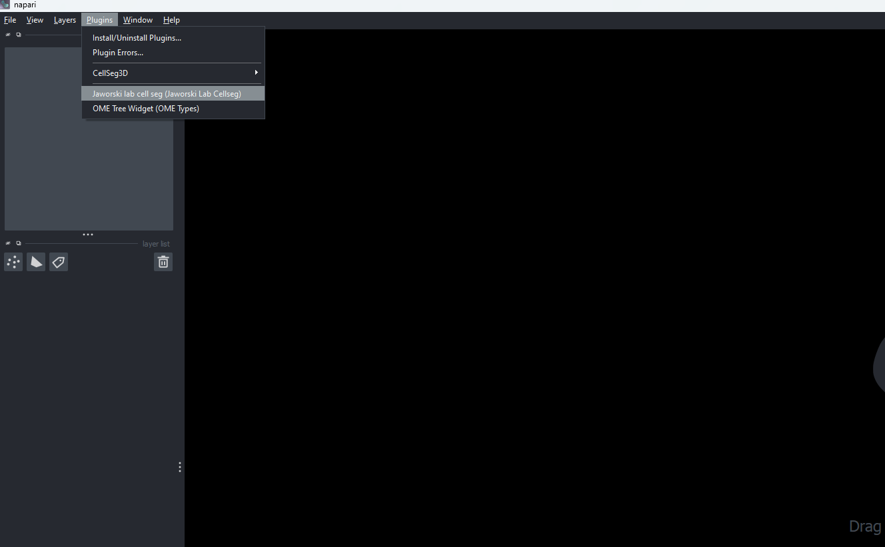
4. After a few seconds the widgets will be added at the right side of the napari window
   
   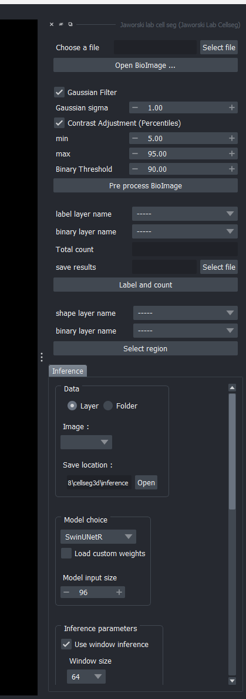

5. The following image illustrates the series of steps to segment, label, and count cells in the dataset.
   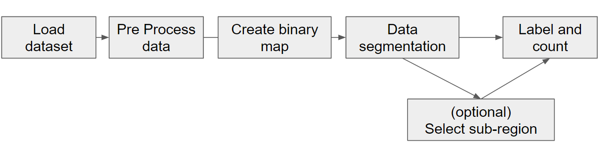

### Load dataset

The top widget includes a button to open a file selection window. Click on "Select File," choose the .oir dataset, and then click the "Open BioImage" button in the widget.
   
   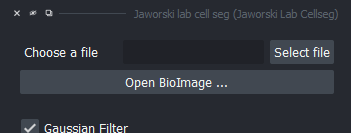


### Pre Process data

This widget allows you to modify various values to adjust the contrast of the dataset and apply a Gaussian filter. By default, we have set values that work best for the Jaworski lab datasets. You don’t need to modify these values, but feel free to adjust them if needed. Once ready, press the "Pre-process BioImage" button, and additional layers will be added to the visualizer.

 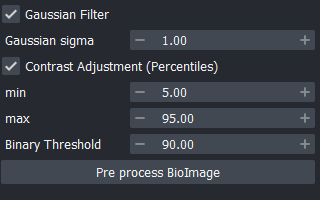

 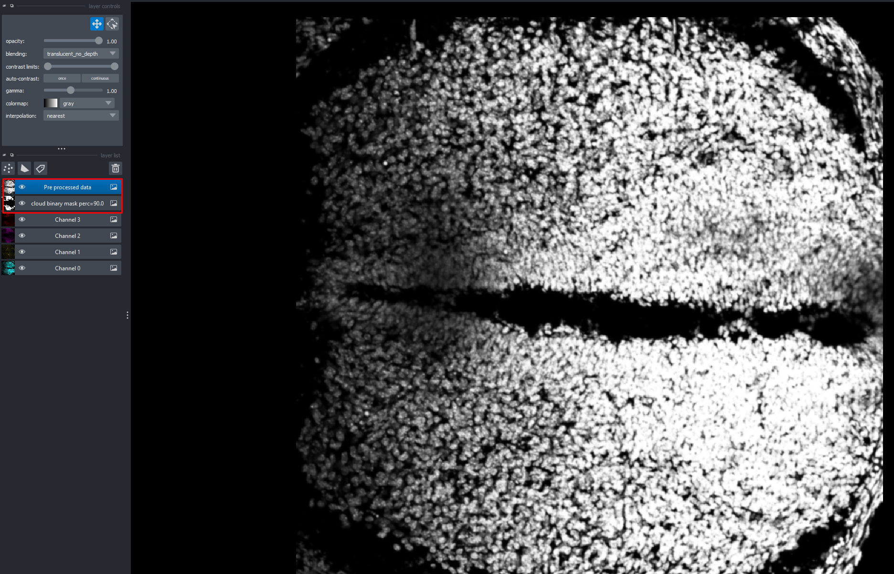

This process creates 2 additional layers (Keep track of these):
- Pre-processed Data: An enhanced version of the dataset that sharpens cell borders and brightens the interior of blobs to help identify multiple cells within a single blob.
- Cloud Binary: A binary image representing the region of interest with the highest probability of containing cells.


### Data Segmentation

For this step we use [napari-CellSeg3D](https://www.napari-hub.org/plugins/napari-cellseg3d) plugin, which is automatically loaded. Please refer to their documentation for guidance on how to use it and achieve optimal segmentation results. By default, this plugin loads the best values for the Jaworski Lab datasets. Feel free to modify these values if necessary. Click the "Start" button and wait for the process to complete (note that it may take considerable time if you are not using a GPU with CUDA support) before proceeding to the next step.

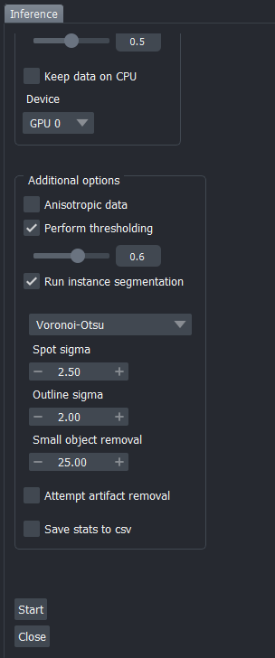

Keep track of the segmentation result layer, as it highlights all the potential spots in the image that may contain a cell. This is the layer you will use to use in the label and count step.

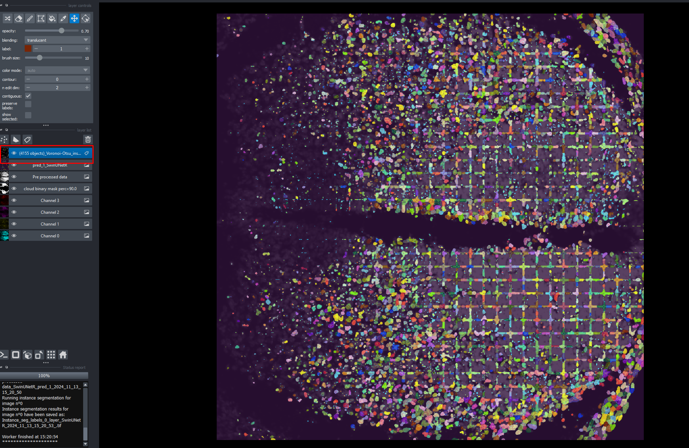  

### (Optional)  Select Subregion

It's possible to count cells in sub regions of the dataset. In order to do so, add a shape layer by folowing these steps:

1. In the top-left corner of the Napari viewer, click the “Add Shapes” button (a rectangle icon in the layer controls).

2. Look for the mode buttons in the top-left corner (below the menu bar). Choose the shape type (e.g., rectangle, ellipse, polygon, or line).

3. Click and drag on the canvas to draw your desired shape.

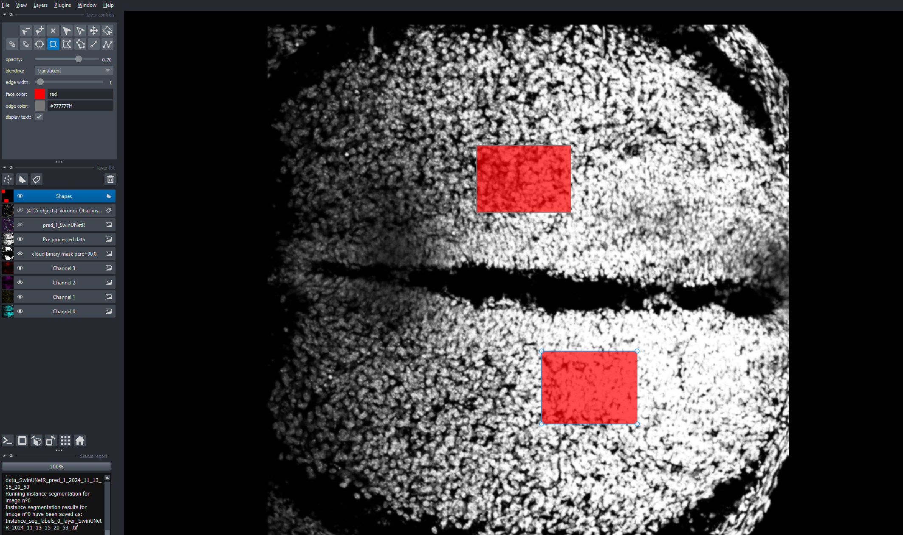  

To select the regions defined by the shapes, navigate to the "Select Region" widget in the plugin. The first dropdown menu will list the available shape layers, while the second dropdown menu will show the cloud binary images. This process subtracts the binary image from the shape layer to isolate the desired regions.

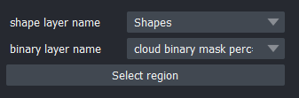  

Start by selecting the shape layer containing the subregions you want to analyze and the binary image created during the "Preprocess Dataset" step. Then, click the "Select Region" button. A new layer will be generated, representing the result of the operation.

This new subregion layer is a binary image that will appear in the "Label and Counting" step and can be used to identify cells within those regions.

### Label and Count

As the final step of our pipeline, we can multiply the layer of potential cells (refer to the "Preprocess Data" step) by the binary map representing the regions where cells are likely to be located. This can be achieved using the "Label and Count" widget.


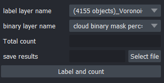  

The first dropdown lists layers containing all potential spots, while the second dropdown displays all available binary images, including subregion binary images. If you'd like to save the results in CSV format, click "Select File" to specify and confirm the file name and save location. Finally, press the "Label and Count" button to complete the process. A new layer with the final results will be added to the viewer.

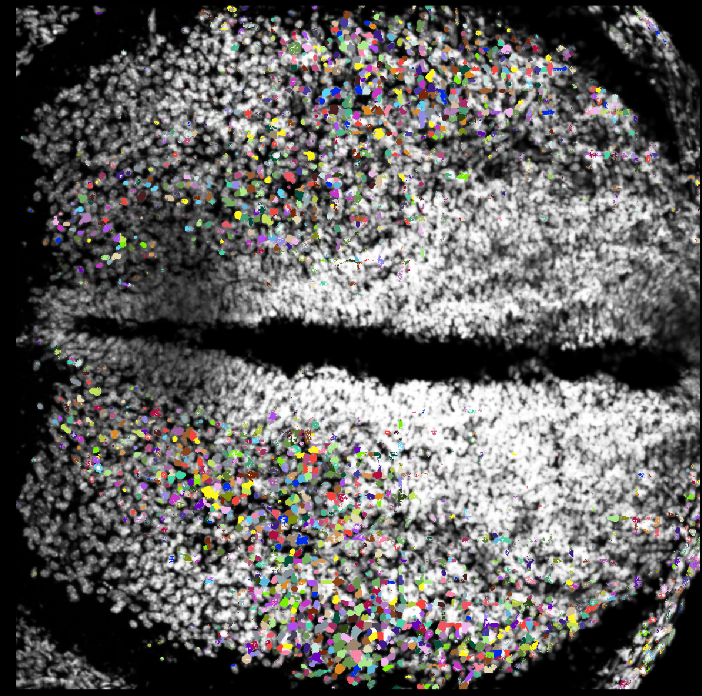  

The "Label and Count" widget will display the number of cells in the dataset.

## For developers

We use [astral-sh](https://github.com/astral-sh)/[uv](https://github.com/astral-sh/uv) to run and build this project. This tool handles virtual environment creation and dependency installation seamlessly. For detailed setup and installation instructions, please refer to their official documentation.

### Requirements
- Python >= 3.9
- (Higly Recommended) PyTorch and CUDA

Once `uv` is installed on your system, clone this repository and run the following command to install the plugin:

```
uv install
```

This command will download and install all required dependencies, including Napari.

To start working with the plugin use the command:

```
uv run napari
```
