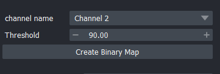

# Jaworski-Lab Napari Plugin

This [Napari](https://napari.org) plugin streamlines the process of segmenting, analyzing, and counting cells in 3D datasets. Designed with researchers in mind, it provides an intuitive interface to handle bioimaging data, offering seamless integration with the [Jaworski Lab](https://www.jaworskilab.com/) datasets and their acquisition hardware.

## Features

- **Load BioFormat Files**: Easily load .oir files created by lab acquisition hardware (e.g., Imaris), ensuring compatibility and a smooth workflow for researchers.
- **Preprocess Data**: Adjust contrast and apply a Gaussian filter to enhance the dataset, followed by thresholding to create binary masks. This step improves the segmentation and labeling of cells for subsequent analysis.
- **Count Cells in Dataset**: Count the number of cells present by combining the enhanced dataset with binary maps. The plugin enables users to focus on regions of interest and generate accurate cell counts.


## User's manual

To load BioFormat images (e.g., `.oir`, `.nd2`), **Java** and **Maven** are required. Please ensure the following:

**Install Java**:  
   - Download and install [Java](https://www.oracle.com/java/technologies/javase/jdk22-archive-downloads.html).
   - Set the `JAVA_HOME` environmental variable to point to your Java installation directory.

**Install Maven**:  
   - Download and install [Maven](https://maven.apache.org/download.cgi).
   - Add the Maven installation directory to the `PATH` environmental variable.

Once both tools are properly configured, you will be ready to work with BioFormat images.

1. Install [napari](https://napari.org/dev/tutorials/fundamentals/installation.html)  

``` pip install "napari[all]" ```

2. Install [napari cell-seg3d](https://github.com/AdaptiveMotorControlLab/CellSeg3D)

``` pip install napari-cellseg3d ```

3. Install this plugin
   
``` pip install git+https://github.com/brown-ccv/jaworski-cellseg.git@v0.1.0 ```

4. (Optional) Install [PyTorch](https://pytorch.org/) and CUDA . Refer to the PyTorch website for instructions on installing the appropriate version that matches the CUDA version in your environment.


### How to use

1. Run napari from your python environment
2. Select the *Plugins* > *Jaworski lab cell seg*  option from the top menu bar

   
4. After a few seconds the widgets will be added at the right side of the napari window
   
   

5. Load your data and follow the series of steps illustrated in the diagram below to segment, label, and count cells. See below for detailed instructions for each step.
   

### Load dataset

The top tool includes a button to open a file selection window. Click on "Select File," choose the .oir dataset, and then click the "Open BioImage" button to load the data.
   
   


### Pre Process data

You may pre-process the image with a Gaussian filter and contrast adjustments. Default values are set to optimal values for the Jaworski lab datasets. Once values are to your preference, click "Pre-process BioImage" and additional layers will be added to the visualizer.

 

 

This process creates 2 additional layers (Keep track of these):
- Pre-processed Data: An enhanced version of the dataset that sharpens cell borders and brightens the interior of blobs to help identify multiple cells within a single blob.

### Create binary mask

To improve the precision of our cell detection efforts within a specific channel, it is essential to create a binary mask. A binary mask is a black-and-white image that defines regions of interest where there is a higher likelihood of locating cells. By combining the segmentation results with this binary mask, we can effectively filter out noise generated during the segmentation process. This approach ensures that the analysis focuses exclusively on potential cells within the specified regions, improving both accuracy and efficiency in cell detection.

 


Use the dropdown menu to select the channel from which you want to create the binary mask. The threshold setting specifies that only pixels with an intensity greater than the defined percentage of the channel's maximum intensity will be included in the mask. This approach helps isolate regions with a higher likelihood of containing cells, enabling a more targeted and precise analysis by focusing on areas of interest while minimizing irrelevant data. Click on the "Create binary Mask" to add the result to the napari viewer


 


### Data Segmentation

The [napari-CellSeg3D](https://www.napari-hub.org/plugins/napari-cellseg3d) plugin is used for segmentation and is automatically loaded. Please refer to their documentation for guidance on usage and achieving optimal segmentation results. By default, this plugin loads the best values for the Jaworski Lab datasets. Click the "Start" button and wait for the process to complete. It may take a long time to finish if you are not using a GPU with CUDA support.


Keep track of the segmentation result layer, as it highlights all the potential spots in the image that may contain a cell. This is the layer you will use during the "Label and Count" step.

  

### (Optional)  Select Subregion

It's possible to count cells in sub regions of the dataset. In order to do so, add a shape layer with the following steps:

1. In the top-left corner of the Napari viewer, click the “Add Shapes” button (a rectangle icon in the layer controls).

2. Look for the mode buttons in the top-left corner (below the menu bar). Choose the shape type (e.g., rectangle, ellipse, polygon, or line).

3. Click and drag on the canvas to draw your desired shape.

  

To select regions defined by the shapes, navigate to the "Select Region" tool in the plugin. The first dropdown menu lists the available shape layers, while the second dropdown menu displays the cloud binary images. This process uses the shape layer to isolate and subtract specific regions from the binary image.

  

Start by selecting the shape layer containing the subregions you want to analyze and the binary image created during the "Preprocess Dataset" step. Then, click the "Select Region" button. A new layer will be generated, representing the result of the operation.

This new subregion layer is a binary image that will appear during the "Label and Count" step and can be used to identify cells within those regions.

### Label and Count

The final step of the pipeline multiplies the layer of potential cells (see the "Preprocess Data" step) by the binary map that highlights regions likely containing cells. This can be accomplished using the "Label and Count" tool.


  

The first dropdown lists layers containing all potential spots, while the second dropdown displays all available binary images, including subregion binary images. If you'd like to save the results in CSV format, click "Select File" to specify and confirm the file name and path. Finally, press the "Label and Count" button to complete the process. A new layer with the final results will be added to the viewer.

  

The "Label and Count" section will display the number of cells in the dataset.

## For developers

We use [astral-sh](https://github.com/astral-sh)/[uv](https://github.com/astral-sh/uv) to run and build this project. This tool handles virtual environment creation and dependency installation seamlessly. For detailed setup and installation instructions, please refer to their official documentation.

### Min Requirements
- Python >= 3.9
-  [Napari](https://napari.org/stable/)
-  [Napari cell-seg3d](https://github.com/AdaptiveMotorControlLab/CellSeg3D)

### Optional (Highly recommended)
-  [PyTorch](https://pytorch.org/) and CUDA for rapid segmentation. Refer to the PyTorch website on how to install it with CUDA support

Once `uv` is installed on your system, clone this repository and run the following command to install the plugin:

```
uv install
```

This command will download and install all required dependencies

To start working with the plugin use the command:

```
uv run napari
```
